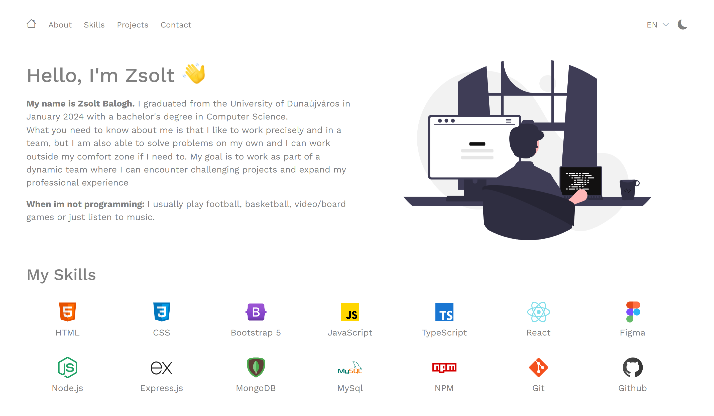

<h1 align="center">Hi 👋, I'm Zsolt</h1>
<h3 align="center">I'm currently looking for a job as a junior software engineer</h3>

  

<h3 align="left">I mainly do web based project because of my interest in web development.</h3>

 :neckbeard: I’m currently working with: **HTML | CSS | Bootstrap | React | TS | Node.js | Express.js**

 :pencil: I’m currently learning: **TypeScript | Node.js | Express.js**

 :eyes: I’m planning to learn: **Three.js | Next.js**

<h3 align="left">Languages and Tools:</h3>

Frontend:

        

Backend:

         
  

Tools:

   

  

<!--

-->

<h3 align="left">Connect with me:</h3>

<h3 align="left">For My Portfolio: <a href="https://zsolt270.github.io/Portfolio/"> Click Here</a></h3>

